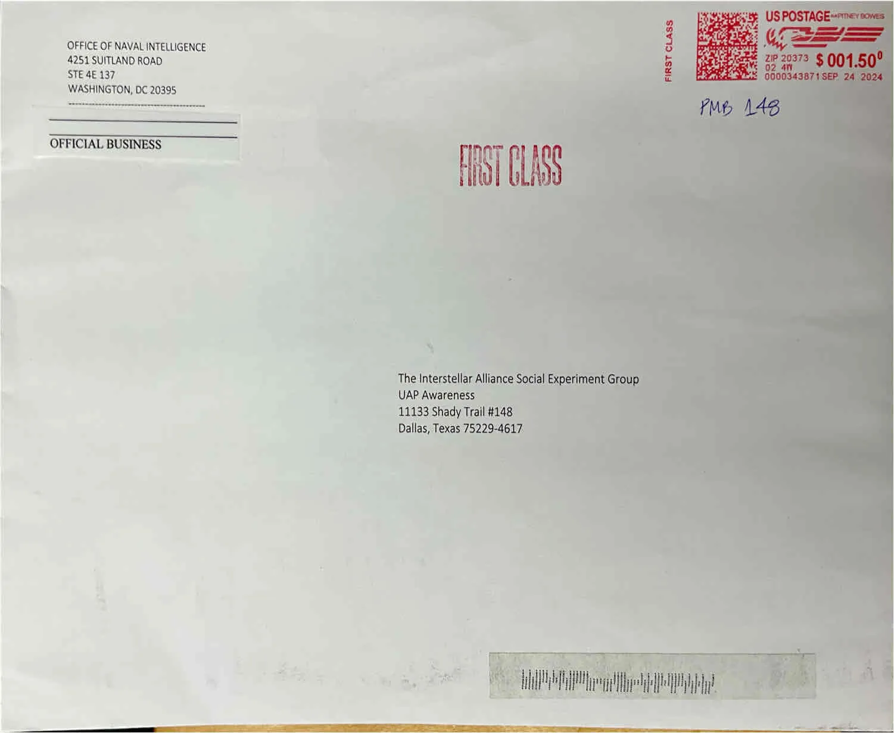
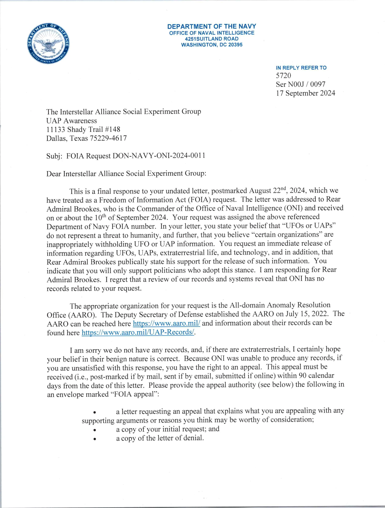
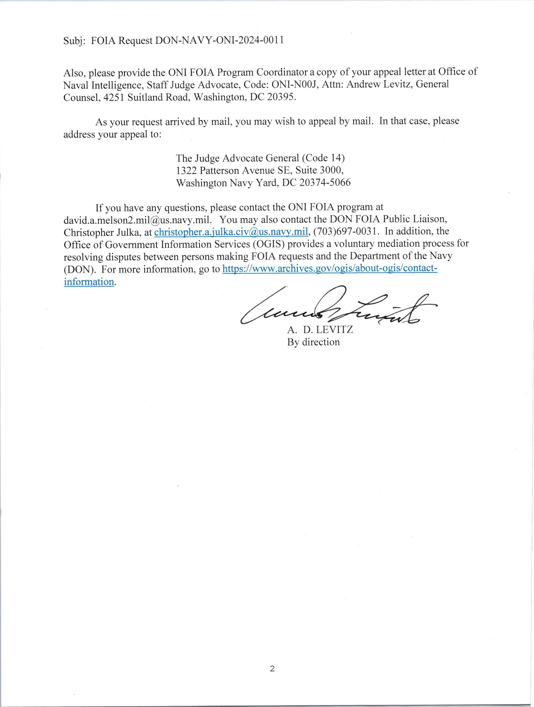

The kind people at the U.S. Office of Naval Intelligence (ONI) responded to our August 2024 [Interstellar Alliance Social Experiment: Step Three](https://www.bashar.org/socialexperiment) letter.

> I'm sorry we do not have any records, and, if there are extraterrestrials, I certainly hope your belief in their benign nature is correct.
> 
> <i>- A. D. Levitz, General Counsel<i/>

The ONI suggests we speak with the [All-domain Anomaly Resolution Office (AARO)](https://www.aaro.mil/) in the U.S. Department of Defense.

